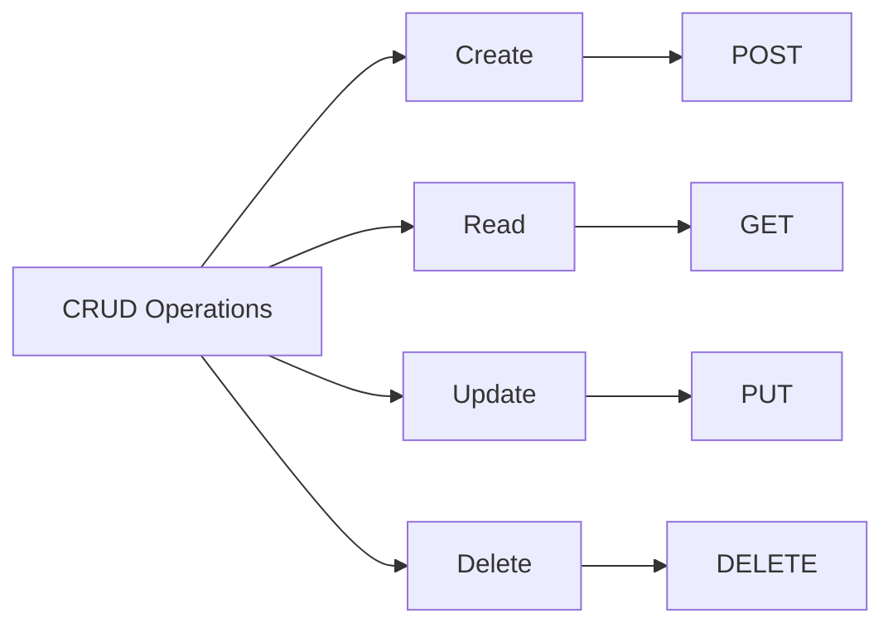
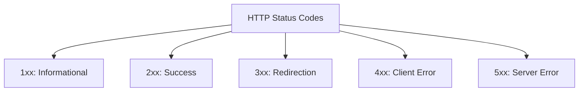
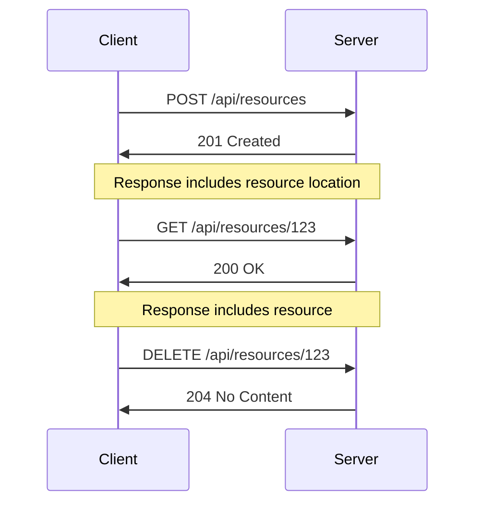
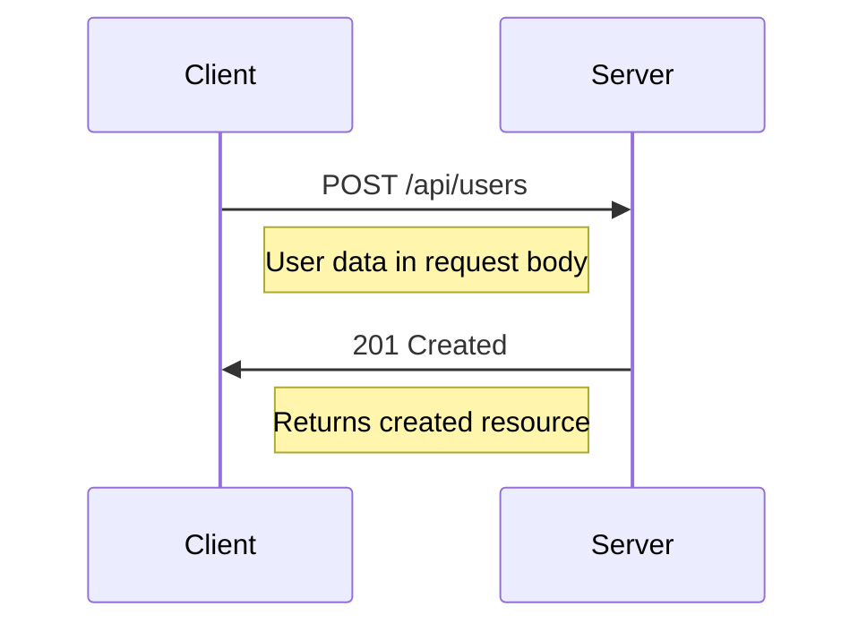
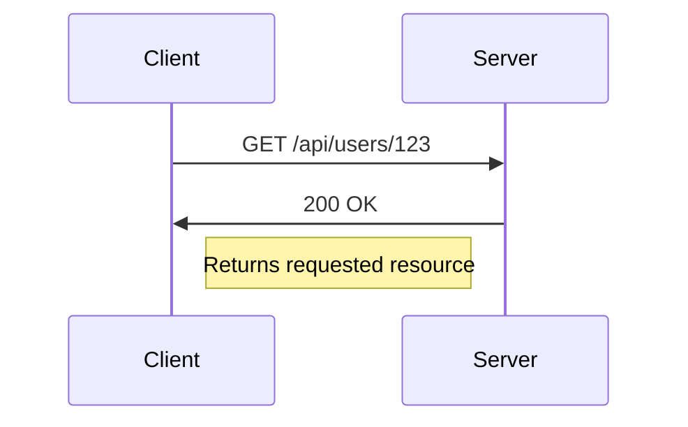
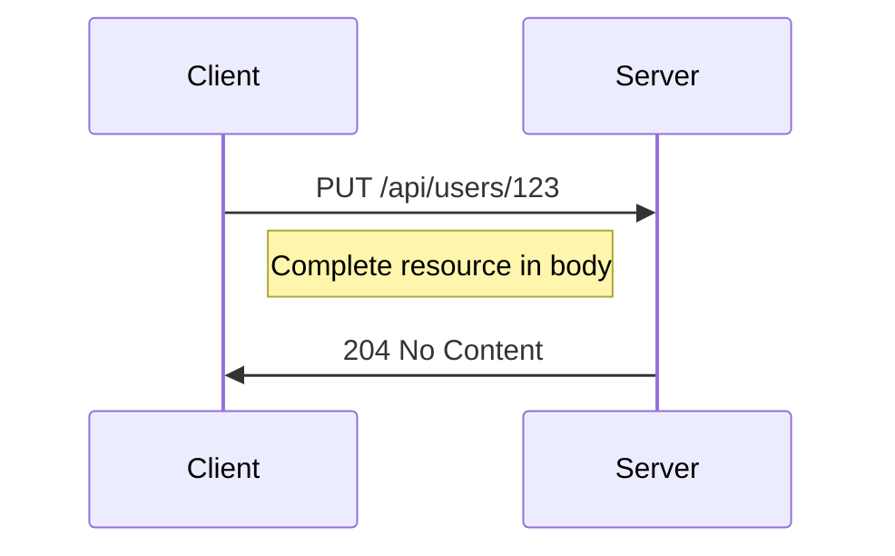
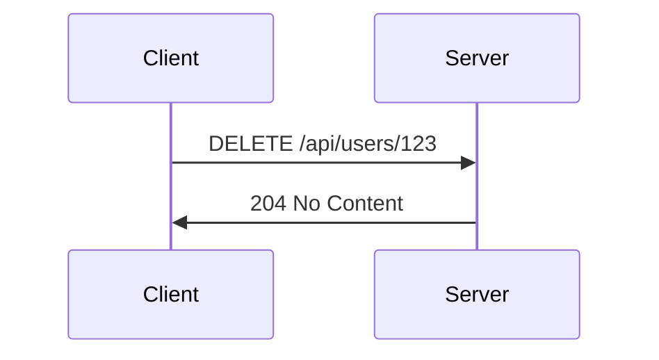

# HTTP Methods and Status Codes

## HTTP Methods (Verbs)



### Main HTTP Methods

| Method | CRUD Operation | Description |
|--------|---------------|-------------|
| POST | Create | Creates new resource on server |
| GET | Read | Retrieves data from server |
| PUT | Update | Updates entire resource |
| DELETE | Delete | Removes resource from server |

## Status Code Groups



### Detailed Status Code Breakdown

#### 2xx Success Codes
| Code | Name | Description |
|------|------|-------------|
| 200 | OK | Request successful, resource returned |
| 201 | Created | Resource created successfully |
| 202 | Accepted | Request accepted but processing not completed |
| 204 | No Content | Request successful, no content to return |



#### 4xx Client Error Codes
| Code | Name | Description |
|------|------|-------------|
| 400 | Bad Request | Invalid request data or format |
| 401 | Unauthorized | Authentication required |
| 404 | Not Found | Resource doesn't exist |
| 405 | Method Not Allowed | HTTP method not supported |

#### 5xx Server Error Codes
| Code | Name | Description |
|------|------|-------------|
| 500 | Internal Server Error | Server encountered an error |

## Common Use Cases

### POST (Create)


### GET (Read)


### PUT (Update)


### DELETE (Remove)


## Status Code Response Examples

### Successful Operations
```http
HTTP/1.1 200 OK
Content-Type: application/json

{
    "id": 123,
    "name": "John Doe"
}
```

### Resource Creation
```http
HTTP/1.1 201 Created
Location: /api/resources/123
Content-Type: application/json

{
    "id": 123,
    "status": "created"
}
```

### Client Errors
```http
HTTP/1.1 400 Bad Request
Content-Type: application/json

{
    "error": "Invalid data format",
    "details": "Name field is required"
}
```

## Best Practices
1. Use appropriate HTTP methods for CRUD operations
2. Return correct status codes
3. Include meaningful error messages
4. Follow RESTful conventions
5. Maintain consistency in API responses

---
*Note: Understanding HTTP methods and status codes is crucial for building robust and reliable web applications and APIs.*
