# HTTP Methods and Status Codes

## HTTP Methods (Verbs)

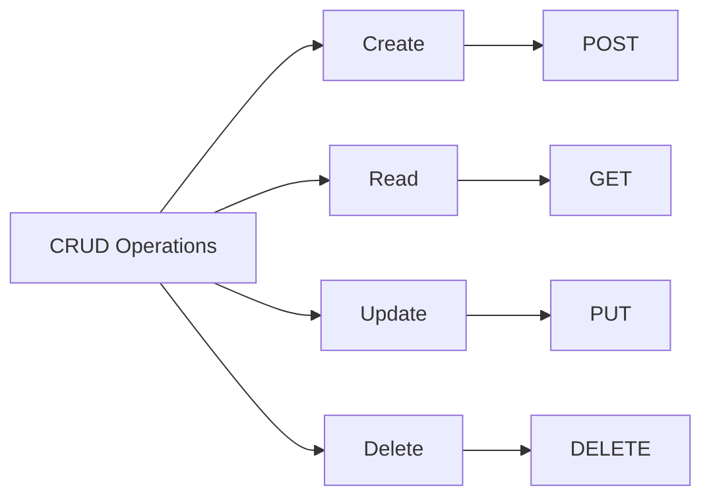
```mermaid
graph LR
    CRUD[CRUD Operations] --> C[Create]
    CRUD --> R[Read]
    CRUD --> U[Update]
    CRUD --> D[Delete]
    
    C --> POST[POST]
    R --> GET[GET]
    U --> PUT[PUT]
    D --> DELETE[DELETE]
```

### Main HTTP Methods

| Method | CRUD Operation | Description |
|--------|---------------|-------------|
| POST | Create | Creates new resource on server |
| GET | Read | Retrieves data from server |
| PUT | Update | Updates entire resource |
| DELETE | Delete | Removes resource from server |

## Status Code Groups

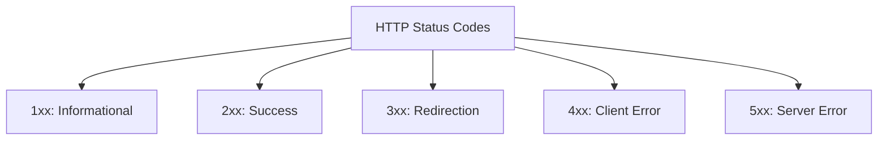
```mermaid
graph TD
    A[HTTP Status Codes] --> B[1xx: Informational]
    A --> C[2xx: Success]
    A --> D[3xx: Redirection]
    A --> E[4xx: Client Error]
    A --> F[5xx: Server Error]
```

### Detailed Status Code Breakdown

#### 2xx Success Codes
| Code | Name | Description |
|------|------|-------------|
| 200 | OK | Request successful, resource returned |
| 201 | Created | Resource created successfully |
| 202 | Accepted | Request accepted but processing not completed |
| 204 | No Content | Request successful, no content to return |

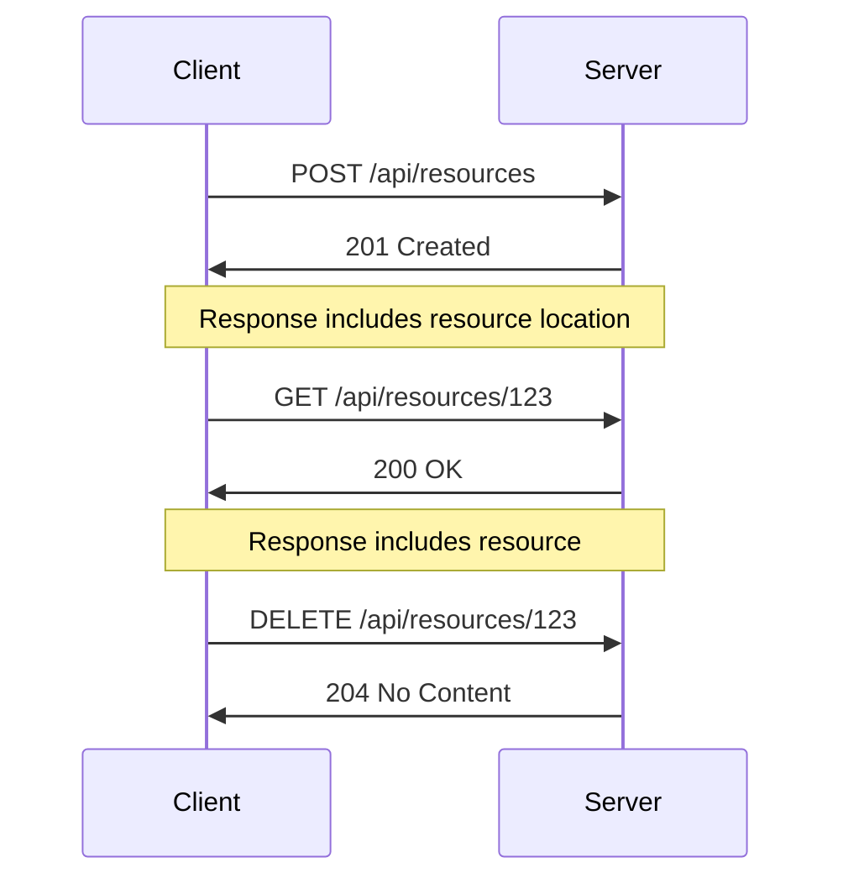
```mermaid
sequenceDiagram
    participant Client
    participant Server
    
    Client->>Server: POST /api/resources
    Server->>Client: 201 Created
    Note over Server,Client: Response includes resource location
    
    Client->>Server: GET /api/resources/123
    Server->>Client: 200 OK
    Note over Server,Client: Response includes resource
    
    Client->>Server: DELETE /api/resources/123
    Server->>Client: 204 No Content
```

#### 4xx Client Error Codes
| Code | Name | Description |
|------|------|-------------|
| 400 | Bad Request | Invalid request data or format |
| 401 | Unauthorized | Authentication required |
| 404 | Not Found | Resource doesn't exist |
| 405 | Method Not Allowed | HTTP method not supported |

#### 5xx Server Error Codes
| Code | Name | Description |
|------|------|-------------|
| 500 | Internal Server Error | Server encountered an error |

## Common Use Cases

### POST (Create)
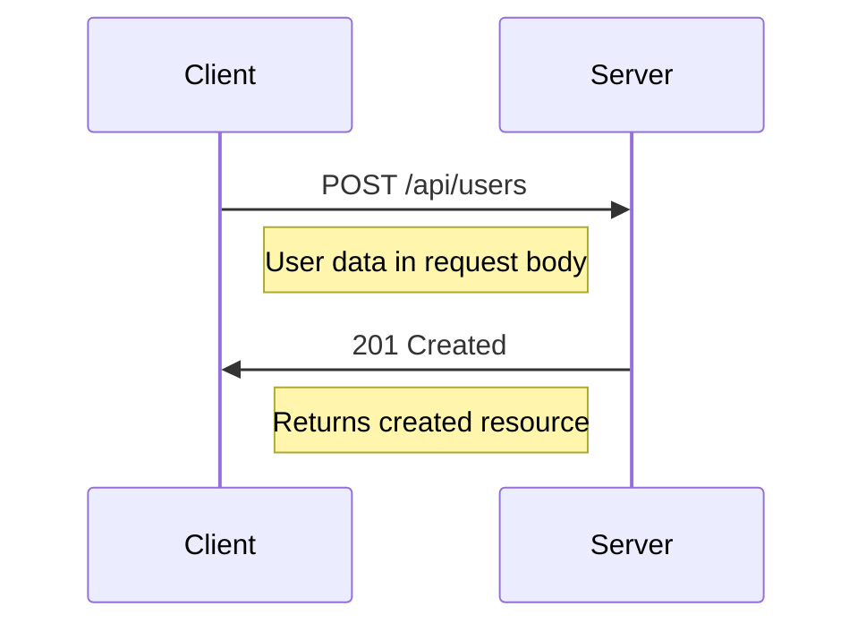
```mermaid
sequenceDiagram
    participant Client
    participant Server
    Client->>Server: POST /api/users
    Note right of Client: User data in request body
    Server->>Client: 201 Created
    Note left of Server: Returns created resource
```

### GET (Read)
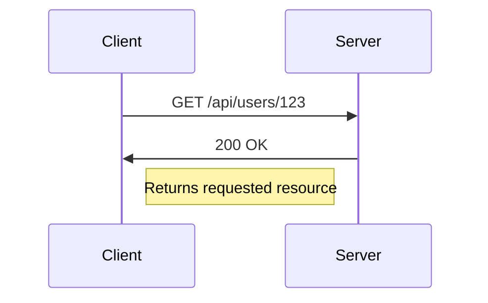
```mermaid
sequenceDiagram
    participant Client
    participant Server
    Client->>Server: GET /api/users/123
    Server->>Client: 200 OK
    Note left of Server: Returns requested resource
```

### PUT (Update)
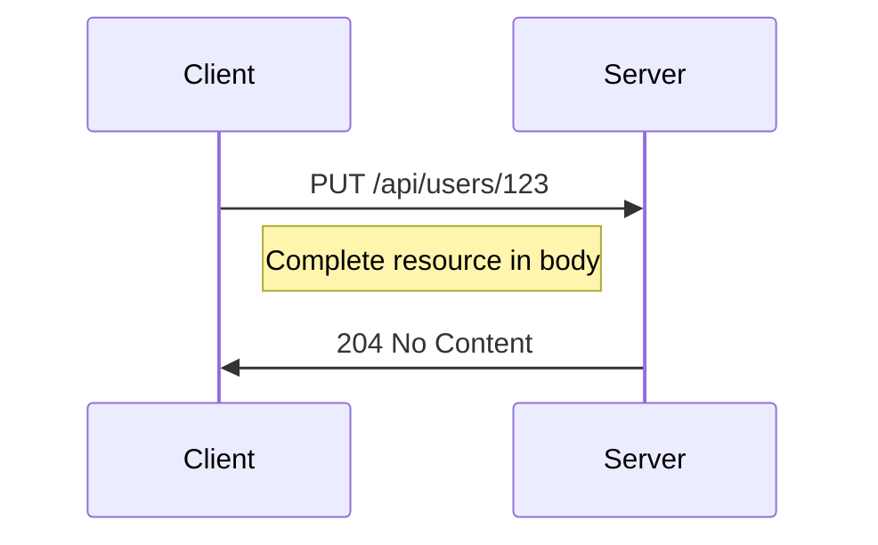
```mermaid
sequenceDiagram
    participant Client
    participant Server
    Client->>Server: PUT /api/users/123
    Note right of Client: Complete resource in body
    Server->>Client: 204 No Content
```

### DELETE (Remove)
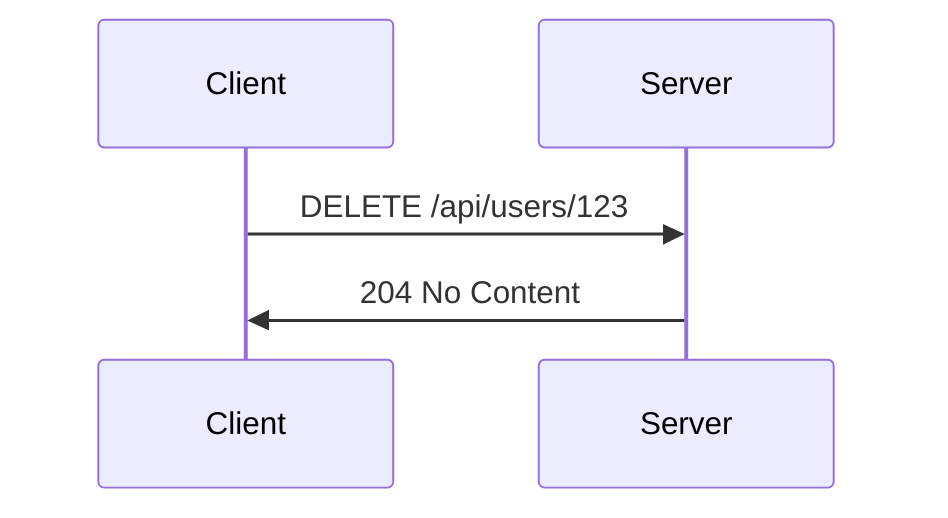
```mermaid
sequenceDiagram
    participant Client
    participant Server
    Client->>Server: DELETE /api/users/123
    Server->>Client: 204 No Content
```

## Status Code Response Examples

### Successful Operations
```http
HTTP/1.1 200 OK
Content-Type: application/json

{
    "id": 123,
    "name": "John Doe"
}
```

### Resource Creation
```http
HTTP/1.1 201 Created
Location: /api/resources/123
Content-Type: application/json

{
    "id": 123,
    "status": "created"
}
```

### Client Errors
```http
HTTP/1.1 400 Bad Request
Content-Type: application/json

{
    "error": "Invalid data format",
    "details": "Name field is required"
}
```

## Best Practices
1. Use appropriate HTTP methods for CRUD operations
2. Return correct status codes
3. Include meaningful error messages
4. Follow RESTful conventions
5. Maintain consistency in API responses

---
*Note: Understanding HTTP methods and status codes is crucial for building robust and reliable web applications and APIs.*


# URI (Uniform Resource Identifier) Structure

## Basic Structure

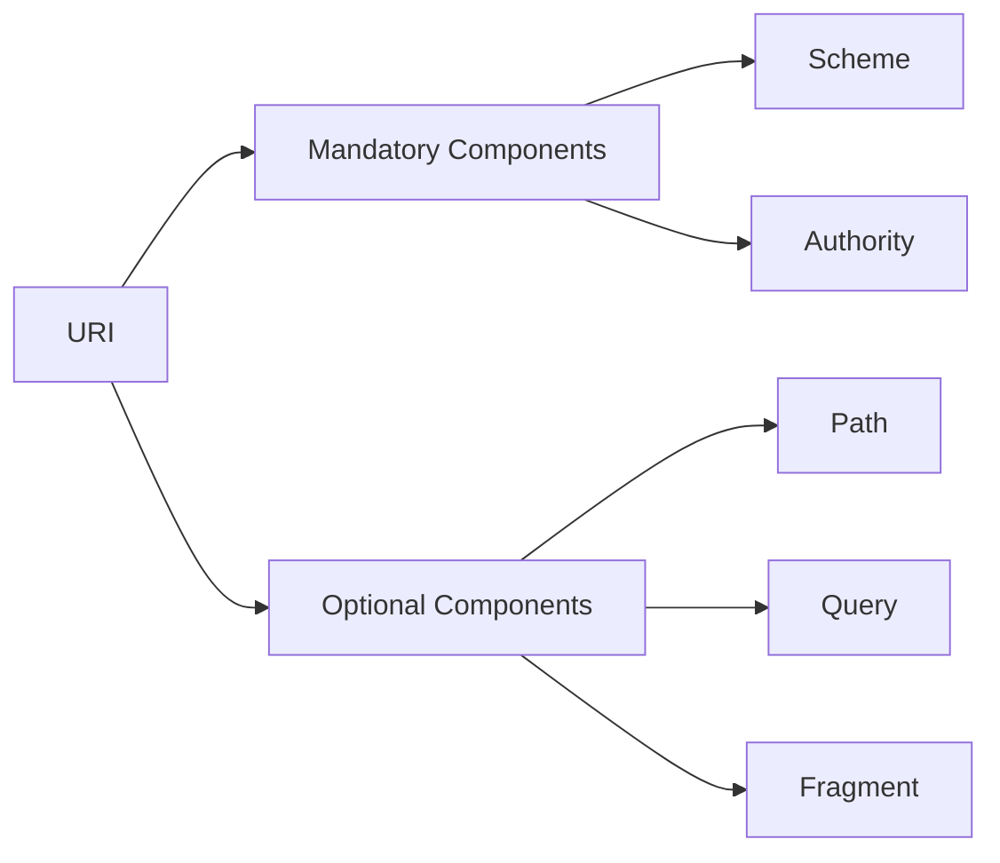
```mermaid
graph LR
    URI --> Mandatory[Mandatory Components]
    URI --> Optional[Optional Components]
    
    Mandatory --> A[Scheme]
    Mandatory --> B[Authority]
    
    Optional --> C[Path]
    Optional --> D[Query]
    Optional --> E[Fragment]
```

## Components Breakdown

### Mandatory Components

#### 1. Scheme
- Defines protocol for server communication
- Common schemes:
  - `http://` (standard)
  - `https://` (secure)
- Always ends with `://`
- Automatically added by browsers
- Visible when URI is copied

#### 2. Authority
- Format: `hostname[:port]`
- Examples:
  - Development: `localhost:3000`
  - Production: `www.example.com`
- Separated from scheme by `://`

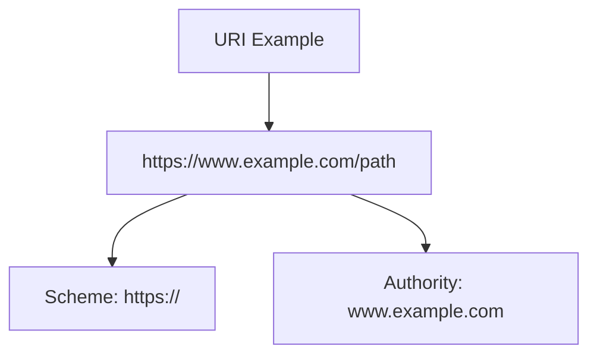
```mermaid
graph TD
    A[URI Example] --> B[https://www.example.com/path]
    B --> C[Scheme: https://]
    B --> D[Authority: www.example.com]
```

### Optional Components

#### 1. Path
- Follows authority
- Can have multiple segments
- Example: `/users/profile/settings`
- Used to identify specific resources

#### 2. Query String
- Starts with `?`
- Format: `key=value`
- Multiple parameters joined by `&`
- Example: `?year=2024&month=1`

#### 3. Fragment
- Starts with `#`
- Used for page navigation
- Points to specific HTML section
- Example: `#section-1`

## Example URIs

### Basic URI
```
https://www.devcreed.com/courses/add
└─┬──┘ └─────┬─────┘ └───┬───┘
  │          │          │
Scheme   Authority     Path
```

### Complex URI with All Components
```
https://www.devcreed.com/courses?year=2024&month=1#api-course
└─┬──┘ └─────┬─────┘ └─┬─┘ └─────┬─────┘ └───┬──┘
  │          │         │         │           │
Scheme   Authority   Path      Query     Fragment
```

## Common Use Cases

### Development Environment
```
http://localhost:3000/api/users
```

### Production Environment
```
https://www.example.com/api/users
```

### With Query Parameters
```
https://api.example.com/products?category=electronics&sort=price
```

### With Fragment
```
https://docs.example.com/guide#installation-steps
```

## Best Practices

1. **Security**
   - Use HTTPS when possible
   - Be careful with sensitive data in URLs

2. **Query Parameters**
   - Use meaningful parameter names
   - Encode special characters
   - Keep URLs reasonably short

3. **Path Structure**
   - Use logical hierarchy
   - Follow RESTful conventions
   - Use lowercase letters
   - Use hyphens for spaces

4. **Fragment Usage**
   - Use for page navigation
   - Keep identifiers meaningful
   - Consider SEO implications

---
*Note: Understanding URI structure is crucial for web development and API design.*


# HTTP vs HTTPS: Web Security Fundamentals

## Protocol Comparison

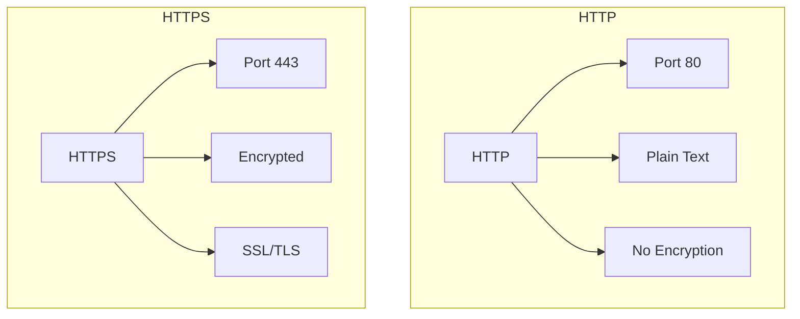
```mermaid
graph TB
    subgraph HTTP
    A[HTTP] --> B[Port 80]
    A --> C[Plain Text]
    A --> D[No Encryption]
    end
    
    subgraph HTTPS
    E[HTTPS] --> F[Port 443]
    E --> G[Encrypted]
    E --> H[SSL/TLS]
    end
```

### HTTP (Hypertext Transfer Protocol)
- Default port: 80
- Plain text communication
- No built-in security
- Vulnerable to:
  - Data interception
  - Man-in-the-middle attacks
  - Data manipulation

### HTTPS (HTTP Secure)
- Default port: 443
- Encrypted communication
- Uses SSL/TLS
- 'S' stands for Secure

## HTTPS Security Features

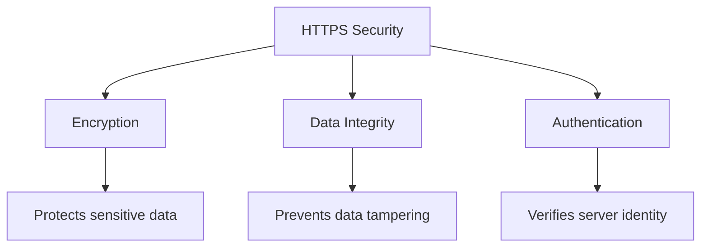
```mermaid
graph TD
    A[HTTPS Security] --> B[Encryption]
    A --> C[Data Integrity]
    A --> D[Authentication]
    
    B --> B1[Protects sensitive data]
    C --> C1[Prevents data tampering]
    D --> D1[Verifies server identity]
```

### 1. Encryption
- Protects data during transmission
- Prevents unauthorized access
- Makes data unreadable to interceptors

### 2. Data Integrity
- Ensures data hasn't been modified
- Detects tampering attempts
- Maintains data authenticity

### 3. Authentication
- Verifies server identity
- Uses digital certificates
- Prevents impersonation attacks

## SSL/TLS Process

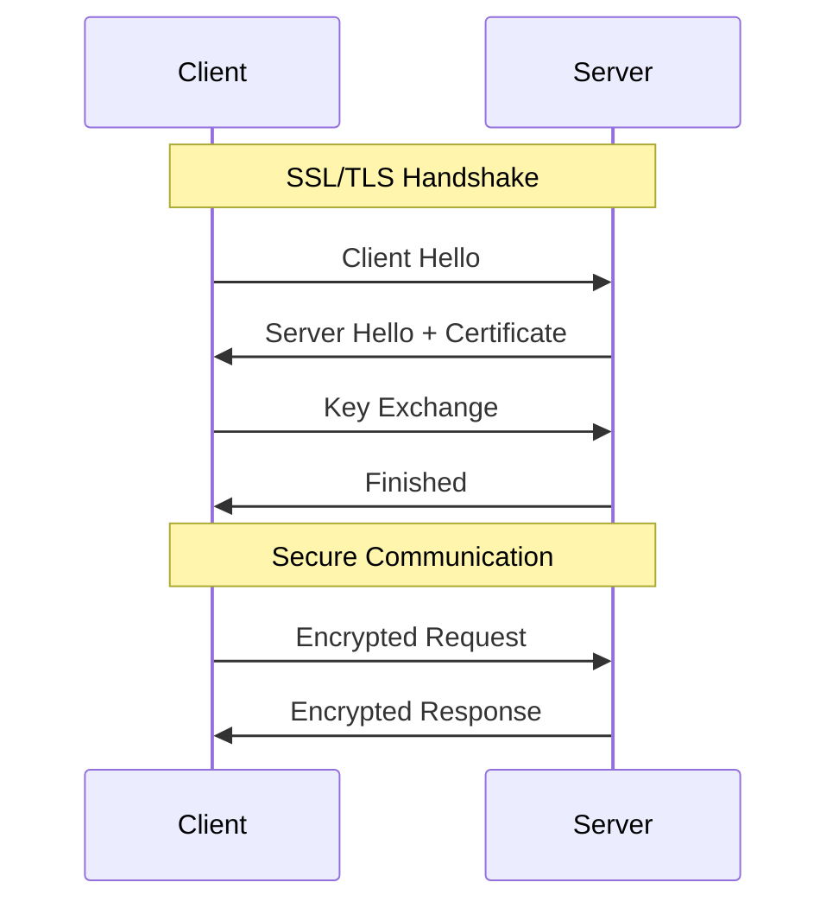
```mermaid
sequenceDiagram
    participant Client
    participant Server
    
    Note over Client,Server: SSL/TLS Handshake
    Client->>Server: Client Hello
    Server->>Client: Server Hello + Certificate
    Client->>Server: Key Exchange
    Server->>Client: Finished
    
    Note over Client,Server: Secure Communication
    Client->>Server: Encrypted Request
    Server->>Client: Encrypted Response
```

### SSL (Secure Sockets Layer)
- Original security protocol
- Predecessor to TLS
- Now considered deprecated

### TLS (Transport Layer Security)
- Modern improvement of SSL
- Current standard for secure communication
- More secure and efficient

## Key Exchange Process

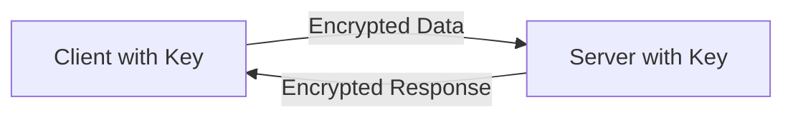
```mermaid
graph LR
    A[Client with Key] -->|Encrypted Data| B[Server with Key]
    B -->|Encrypted Response| A
```

### How It Works
1. Server obtains SSL/TLS certificate
2. Client and server establish shared key
3. Both use same key for:
   - Request encryption
   - Response encryption
   - Data decryption

## Security Benefits

### 1. Protected Data Types
- Login credentials
- Payment information
- Personal data
- Session tokens
- Cookies

### 2. Business Benefits
- Customer trust
- SEO advantages
- Regulatory compliance
- Brand protection

## Best Practices

1. **Certificate Management**
   - Keep certificates up to date
   - Use trusted certificate authorities
   - Implement proper renewal procedures

2. **Security Configuration**
   - Enable HSTS
   - Use secure cipher suites
   - Configure proper TLS versions

3. **Monitoring**
   - Regular security audits
   - Certificate expiration monitoring
   - Security vulnerability scanning

## Implementation Checklist
- [ ] Obtain SSL/TLS certificate
- [ ] Configure web server for HTTPS
- [ ] Set up automatic certificate renewal
- [ ] Implement HTTPS redirects
- [ ] Test secure connection
- [ ] Monitor security status

---
*Note: HTTPS is crucial for protecting sensitive data and maintaining user trust in web applications.*


# REST (Representational State Transfer)

## Overview

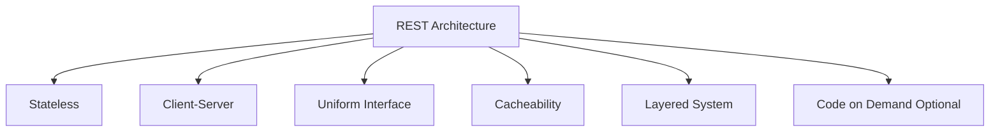
```mermaid
graph TD
    REST[REST Architecture] --> A[Stateless]
    REST --> B[Client-Server]
    REST --> C[Uniform Interface]
    REST --> D[Cacheability]
    REST --> E[Layered System]
    REST --> F[Code on Demand Optional]
```

## Core Principles

### 1. Stateless
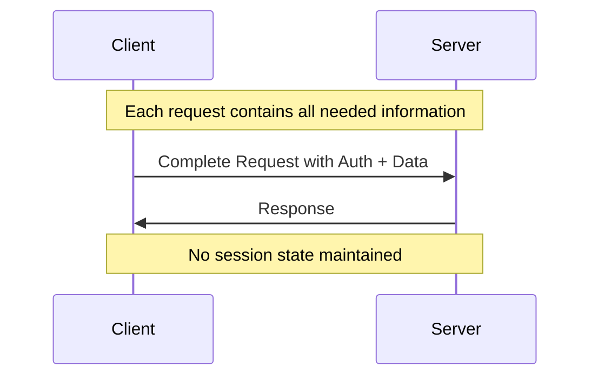
```mermaid
sequenceDiagram
    participant Client
    participant Server
    Note over Client,Server: Each request contains all needed information
    Client->>Server: Complete Request with Auth + Data
    Server->>Client: Response
    Note over Client,Server: No session state maintained
```

#### Key Points:
- Each request must be self-contained
- Server doesn't store client session information
- All information needed for processing included in request
- No dependency on previous requests

### 2. Client-Server Separation
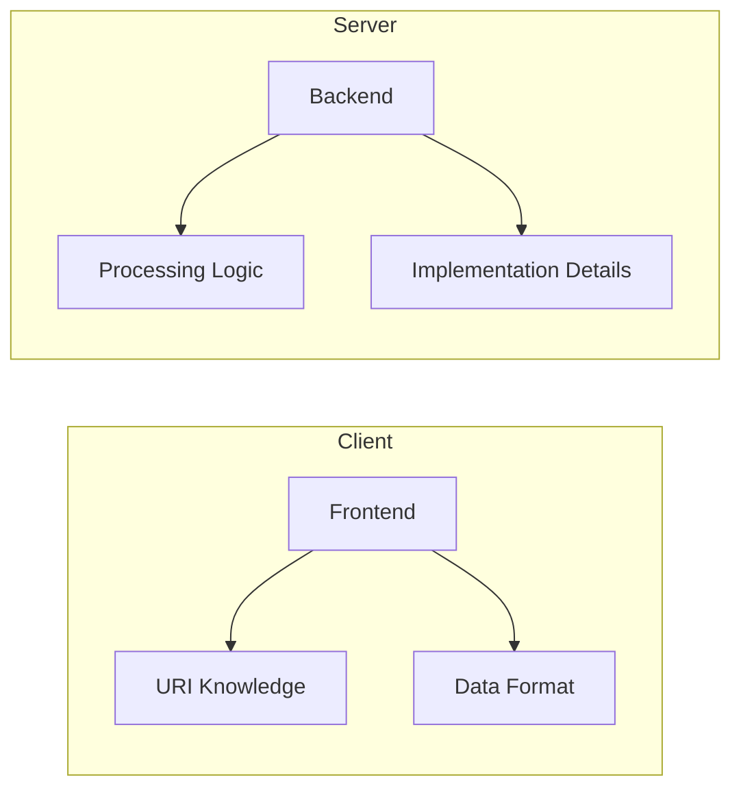
```mermaid
graph LR
    subgraph Client
    A[Frontend] --> B[URI Knowledge]
    A --> C[Data Format]
    end
    
    subgraph Server
    D[Backend] --> E[Processing Logic]
    D --> F[Implementation Details]
    end
```

#### Characteristics:
- Independent evolution of client and server
- Client only needs to know:
  - Resource URIs
  - Data formats
  - Required parameters
- Implementation details hidden from client

### 3. Uniform Interface

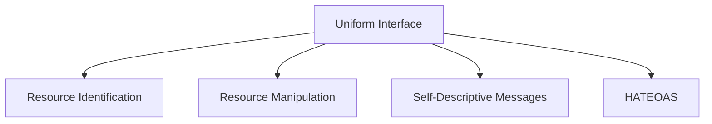
```mermaid
graph TD
    UI[Uniform Interface] --> A[Resource Identification]
    UI --> B[Resource Manipulation]
    UI --> C[Self-Descriptive Messages]
    UI --> D[HATEOAS]
```

#### A. Resource Identification
- Every resource has unique URI
- Clear naming conventions
- Consistent addressing scheme

#### B. Resource Manipulation
- Standard methods (GET, POST, PUT, DELETE)
- Clear representation formats
- Client understanding of manipulation capabilities

#### C. Self-Descriptive Messages
```json
{
  "id": 123,
  "type": "order",
  "status": "pending",
  "actions": ["cancel", "update"],
  "links": {
    "self": "/orders/123",
    "update": "/orders/123/update"
  }
}
```

#### D. Hypermedia as the Engine of Application state  (HATEOAS)
```json
{
  "order": {
    "id": 123,
    "_links": {
      "cancel": {"href": "/orders/123/cancel"},
      "update": {"href": "/orders/123/update"},
      "payment": {"href": "/orders/123/payment"}
    }
  }
}
```

### 4. Cacheability
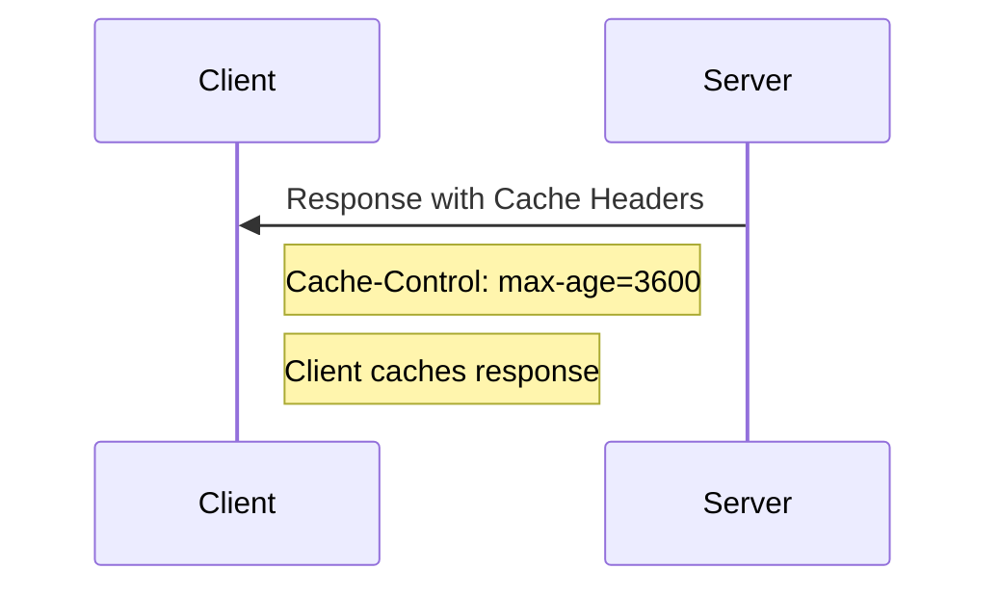
```mermaid
sequenceDiagram
    participant Client
    participant Server
    Server->>Client: Response with Cache Headers
    Note right of Client: Cache-Control: max-age=3600
    Note right of Client: Client caches response
```

#### Features:
- Server defines cache policies
- Client can implement caching
- Cache headers in responses
- Performance optimization

### 5. Layered System
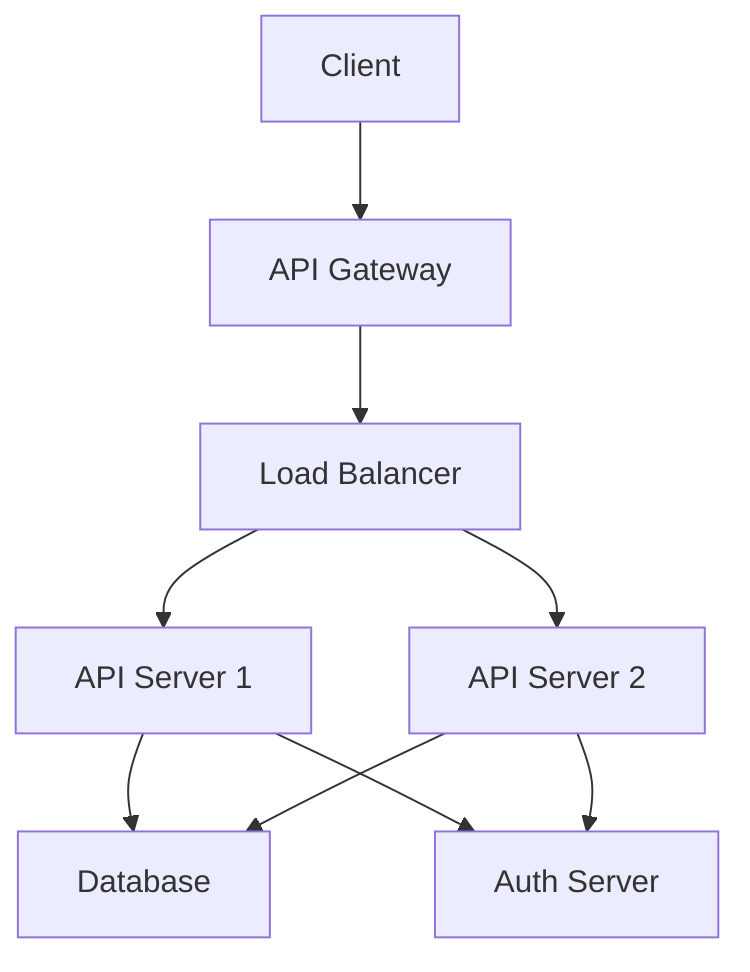
```mermaid
graph TD
    Client --> Gateway[API Gateway]
    Gateway --> LoadBalancer[Load Balancer]
    LoadBalancer --> API1[API Server 1]
    LoadBalancer --> API2[API Server 2]
    API1 --> DB[Database]
    API2 --> DB
    API1 --> Auth[Auth Server]
    API2 --> Auth
```

#### Benefits:
- Scalability
- Security
- Load balancing
- Microservices architecture
- Separation of concerns

### 6. Code on Demand (Optional)
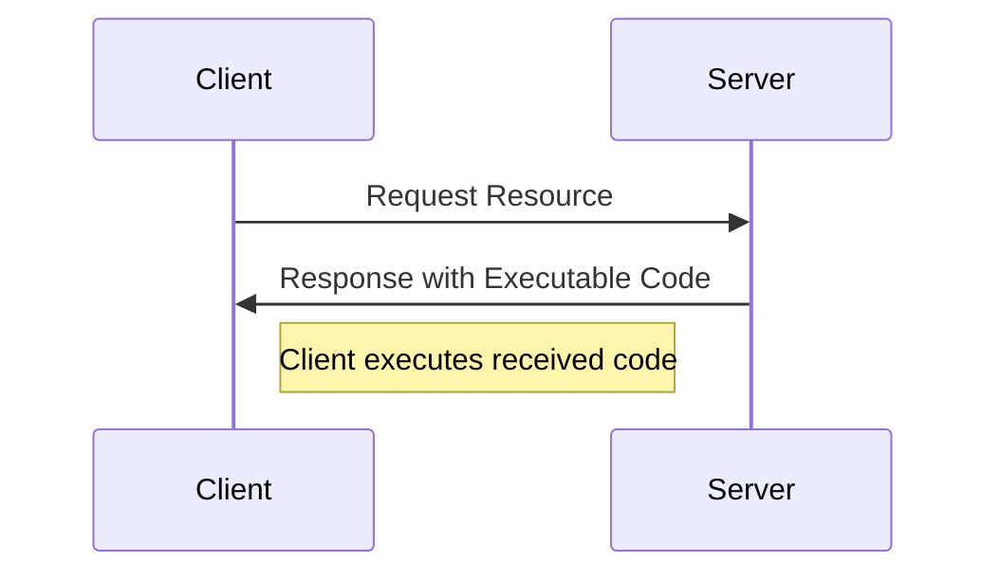
```mermaid
sequenceDiagram
    participant Client
    participant Server
    Client->>Server: Request Resource
    Server->>Client: Response with Executable Code
    Note right of Client: Client executes received code
```

#### Characteristics:
- Optional constraint
- Server can send executable code
- Client-side execution
- Rarely implemented

## Best Practices

1. **API Design**
   - Use meaningful URIs
   - Implement proper HTTP methods
   - Maintain consistent response formats

2. **Security**
   - Implement authentication
   - Use HTTPS
   - Validate all inputs

3. **Performance**
   - Implement caching
   - Optimize response size
   - Use compression

4. **Documentation**
   - Clear API documentation
   - Example requests/responses
   - Error handling guidelines

---
*Note: Understanding REST principles is crucial for building scalable and maintainable web APIs.*


# REST API URL Naming Conventions

## Basic Principles

```mermaid
graph TD
    A[API URL Structure] --> B[Use Nouns]
    A --> C[Avoid Verbs]
    A --> D[Use Plurals]
    A --> E[Hierarchical Resources]
    
    B --> B1[orders vs getOrders]
    C --> C1[HTTP verbs define action]
    D --> D1[/orders vs /order]
    E --> E1[/orders/{orderId}/items]
```

## ❌ Incorrect vs ✅ Correct Patterns

### Collection Resources

#### Getting All Orders
❌ Incorrect:
```
GET /getOrders
GET /getAllOrders
GET /orderList
```

✅ Correct:
```
GET /orders
```

### Single Resource

#### Getting Specific Order
❌ Incorrect:
```
GET /getOrder/{id}
GET /order/get/{id}
GET /fetchOrder/{id}
```

✅ Correct:
```
GET /orders/{id}
```

### Creating Resources

#### Creating New Order
❌ Incorrect:
```
POST /createOrder
POST /orders/create
POST /addOrder
```

✅ Correct:
```
POST /orders
```

## Resource Hierarchy Examples

### Orders and Items Relationship

```mermaid
graph TD
    A[Orders Collection] --> B[Single Order]
    B --> C[Items Collection]
    C --> D[Single Item]
    
    A --GET--> |/orders| AA[List Orders]
    B --GET--> |/orders/{orderId}| BB[Get Order]
    C --GET--> |/orders/{orderId}/items| CC[List Items]
    D --GET--> |/orders/{orderId}/items/{itemId}| DD[Get Item]
```

### Complete Resource Patterns

#### Orders Resource
| HTTP Method | URL Pattern | Action |
|------------|-------------|---------|
| GET | `/orders` | List all orders |
| POST | `/orders` | Create new order |
| GET | `/orders/{id}` | Get specific order |
| PUT | `/orders/{id}` | Update specific order |
| DELETE | `/orders/{id}` | Delete specific order |

#### Order Items Resource
| HTTP Method | URL Pattern | Action |
|------------|-------------|---------|
| GET | `/orders/{orderId}/items` | List all items in order |
| POST | `/orders/{orderId}/items` | Add item to order |
| GET | `/orders/{orderId}/items/{itemId}` | Get specific item |
| PUT | `/orders/{orderId}/items/{itemId}` | Update specific item |
| DELETE | `/orders/{orderId}/items/{itemId}` | Delete specific item |

## Best Practices

### 1. Use Plural Nouns
```
/orders instead of /order
/users instead of /user
/products instead of /product
```

### 2. Use Resource Identifiers
```
/orders/{orderId}
/users/{userId}
/products/{productId}
```

### 3. Represent Hierarchical Relationships
```
/orders/{orderId}/items
/users/{userId}/addresses
/products/{productId}/variants
```

### 4. Keep URLs Simple and Readable
✅ Good:
```
GET /orders
GET /orders/{orderId}
GET /orders/{orderId}/items
```

❌ Bad:
```
GET /get-all-orders
GET /order-management/get/{id}
GET /order-items-list/{orderId}
```

### 5. Use Query Parameters for Filtering
```
GET /orders?status=pending
GET /orders?createDate=2024-01-01
GET /orders?sort=date&direction=desc
```

## Common Patterns

```mermaid
sequenceDiagram
    participant Client
    participant API
    
    Client->>API: GET /orders
    Note right of Client: List all orders
    
    Client->>API: POST /orders
    Note right of Client: Create new order
    
    Client->>API: GET /orders/{id}
    Note right of Client: Get specific order
    
    Client->>API: GET /orders/{id}/items
    Note right of Client: List items in order
```

## Guidelines Summary
1. Use nouns, not verbs
2. Use plural form for collections
3. Use hierarchy for related resources
4. Keep URLs simple and consistent
5. Use query parameters for filtering/sorting
6. Follow HTTP method semantics

---
*Note: Consistent URL naming is crucial for creating intuitive and maintainable APIs.*
